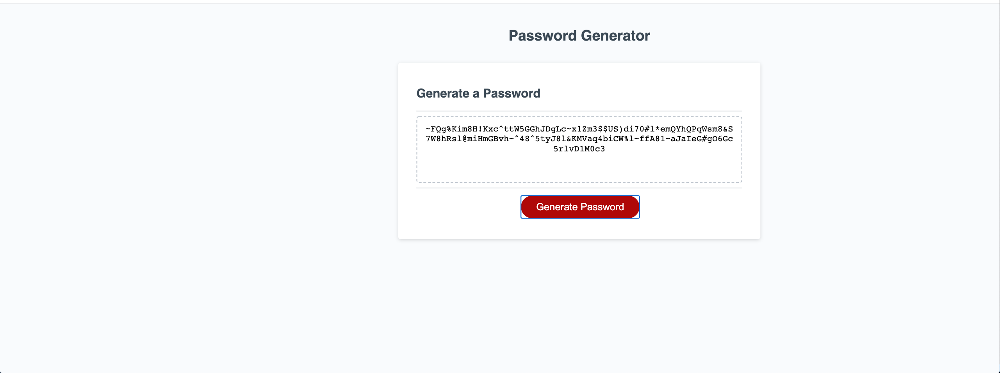

# homework-3-password-generator

# homework-3

## Project Overview

This is my homework #3 password generator.

Objective from this week's homework was to modify starter code to create an application that enables employees to generate random passwords based on 4 criteria they've selected. (lowercase, uppercase, numbers, and special characters.)

My logic behind writing the Javascript was done in following sequence.

1.) I declared lowercase, uppercase, numbers, and special characters array in the global scope, so that they're accessible from the function.
2.) Next I created a function called "generatePassword" and gave a series of prompts & confirm asking to select a password characters between 8 and 128 characters, and if they wanted to include lowercase, uppercase, numbers, and special characters in their password.
3.) Next, based on user's selected choice for lowercase, uppercase, numbers, and special characters, I put that into an array of "possibleCharacters."
4.) Afterwards, I created a for loop function from the selected choices that user input and put that into an array of "randomPassword"
5.) Finally, I put the user input into an existing textarea display on HTML page so that, randomly created password gets displayed on the page.

Attached is my screenshot of my password generator page.

## Attached is also a personal link to my homework assignment #2.

## https://jung0808.github.io/homework-3-password-generator/

## https://github.com/jung0808/homework-3-password-generator
